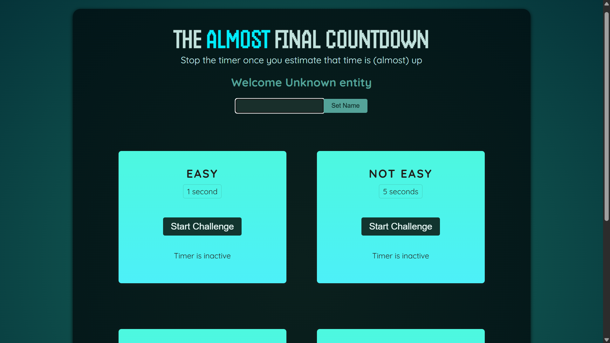

# The Almost Final Countdown - Timer Challenge Game

A React-based browser game that challenges players to stop a timer as close as possible to a target time. Built with modern React patterns and tooling to demonstrate proficiency in frontend development.

## Project Overview

This interactive game tests players' timing precision across four difficulty levels (1s, 5s, 10s, and 15s). The application showcases advanced React concepts including refs, portals, and imperative API handling—all within a clean, polished UI.

**Live Features:**

- Real-time timer with millisecond precision
- Dynamic player name input and greeting
- Four difficulty levels with instant feedback
- Score calculation based on accuracy
- Result modal with game outcome display
- Responsive, modern design with gradient styling

## 🎯 Live Demo

**Play the game now:** [https://time-stopping-game.vercel.app/](https://time-stopping-game.vercel.app/)



## Key Learning Outcomes

### Advanced React Concepts

#### 1. **React Refs (useRef)**

- Manages timer intervals without re-renders
- Direct DOM manipulation for modal control
- Captures uncontrolled input values
- **Use case in code**: `useRef()` for timer intervals and dialog references

#### 2. **React Portals (createPortal)**

- Renders modal outside the component hierarchy
- Keeps DOM structure clean and semantic
- **Use case in code**: Result modal renders to a dedicated `#modal` div

#### 3. **Imperative Handles (useImperativeHandle)**

- Exposes imperative methods from functional components
- Parent components can programmatically call child methods
- **Use case in code**: `onRef.current.open()` to show modal from parent

#### 4. **State Management (useState)**

- Player name tracking
- Timer remaining time updates
- Game state across challenges
- **Use case in code**: Real-time timer countdown updates

### Technical Implementation

```jsx
// Example: useRef for timer management
const timer = useRef();

function handleStart() {
  timer.current = setInterval(() => {
    setTimeRemaining((prev) => prev - 10);
  }, 10);
}

function handleStop() {
  clearInterval(timer.current);
  dialog.current.open();
}
```

```jsx
// Example: useImperativeHandle for modal control
useImperativeHandle(ref, () => ({
  open() {
    dialog.current.showModal();
  },
}));
```

## Project Structure

```
src/
├── components/
│   ├── Player.jsx           # Player name input & greeting
│   ├── TimerChallenge.jsx   # Core game logic with timer
│   └── ResultModal.jsx      # Portal-based result display
├── App.jsx                  # Main app wrapper
├── index.css                # Styling with gradients & fonts
└── main.jsx                 # React root mounting
```

## Tech Stack

- **React 19.0.0** - Latest React with modern hooks API
- **Vite 4.4.5** - Lightning-fast build tool and dev server
- **ESLint** - Code quality enforcement
- **CSS3** - Animations, gradients, responsive design
- **HTML5** - Semantic markup with Portals support

## Game Mechanics

Each challenge calculates a score based on timing accuracy:

```javascript
score = (1 - remainingTime / targetTime) × 100
```

- **Score 100**: Perfect timing
- **Score 0-99**: Close attempt
- **Score < 0**: Missed the target (timer expired)

## Features Implemented

| Feature               | Technology                             | Purpose                      |
| --------------------- | -------------------------------------- | ---------------------------- |
| Timer Management      | `useRef` + `setInterval`               | Precise millisecond tracking |
| Modal Display         | `createPortal` + `useImperativeHandle` | Uncontrolled modal rendering |
| Input Handling        | `useRef` + `useState`                  | Player name capture          |
| Conditional Rendering | React JSX                              | Dynamic UI states            |
| State Updates         | `useState`                             | Real-time game updates       |
| Event Handling        | onClick handlers                       | User interactions            |

## Getting Started

### Prerequisites

- Node.js (v16 or higher)
- npm or yarn

### Installation

```bash
# Clone the repository
git clone <repository-url>
cd time-stopping-game

# Install dependencies
npm install

# Start development server
npm run dev
```

### Build for Production

```bash
npm run build
npm run preview  # Preview production build locally
```

## Code Quality

- **ESLint Configuration**: Enforces React best practices and hook rules
- **No Console Warnings**: Strict linting with max-warnings set to 0
- **Component Structure**: Modular, reusable, and maintainable
- **Hook Compliance**: Proper use of React Hook rules

Run linter:

```bash
npm run lint
```

## Key Design Decisions

1. **Refs over State for Timers**: Using refs prevents unnecessary re-renders when tracking intervals
2. **Portals for Modals**: Keeps the DOM structure clean and avoids z-index stacking issues
3. **Imperative API**: Allows parent-controlled modal visibility while maintaining component encapsulation
4. **Millisecond Precision**: 10ms interval updates ensure smooth timer experience
5. **Score Calculation**: Linear calculation provides immediate feedback on performance
